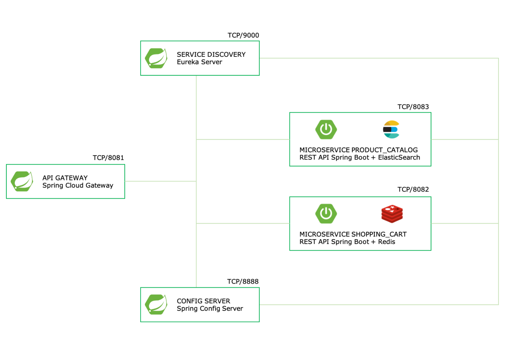

## Construindo um projeto com arquitetura baseada em microsserviços usando Spring Cloud

Neste projeto eu desenvolvi um pequeno sistema para controle de Produtos e Carrinho de Compras de um Ecommerce através de uma API REST.<br>

O projeto é composto por:
- 2 Bancos de dados para fins didáticos (Elasticsearch e Redis);
- 2 Microserviços (Product Catalog e Shopping Cart);
- 1 Config Server;
- 1 Service Discovery;
- 1 Gateway

Para criar os bancos de dados use o Docker, disponível na pasta docker; 

Topologia:


<br>
<br>


São necessários os seguintes pré-requisitos para a execução do projeto:

- Java 11 ou versões superiores.
- Gradle 2.5.2 ou versões superiores.
- Docker
- IntelliJ IDEA Community Edition ou sua IDE favorita.
<br>
  
<br>

  
Links Úteis:
- [Referência do IntelliJ IDEA Community, para download](https://www.jetbrains.com/idea/download)
- [Palheta de atalhos de comandos do Intellij](https://resources.jetbrains.com/storage/products/intellij-idea/docs/IntelliJIDEA_ReferenceCard.pdf)
- [Site oficial do Spring](https://spring.io/)
- [Site oficial do Spring Initialzr, para setup do projeto](https://start.spring.io/)
- [Site oficial do Git](https://git-scm.com/)
- [Site oficial do GitHub](http://github.com/)
- [Site oficial do Postman](https://www.postman.com/)
- [Site oficial do Swagger](https://swagger.io/)
- [Site oficial do Docker](https://www.docker.com/)
- [Site oficial do Elasticsearch](https://www.elastic.co/pt/)
- [Site oficial do Redis](https://redis.io/)
- [Documentação oficial do Lombok](https://projectlombok.org/)


<br>
  
<br>
Após executar os microserviços e popular os bancos, você pode acessar o projeto através dos endereços abaixo:
<br>
<br>

URL Shopping Cart via Gateway:

```
http://localhost:8081/cart/{id}
```
<br>

URL Product Catalog via Gateway:
```
http://localhost:8081/product/{id}
```
<br>

URLs direta do Shopping Cart:
```
http://localhost:8082/cart/{id}
http://localhost:8082/swagger-ui.html
```

<br>

URLs direta do Product Catalog:
```
http://localhost:8083/product/{id}
http://localhost:8083/swagger-ui.html
```

<br>

URL Service Discovery Eureka Server:
```
http://localhost:9000/
```